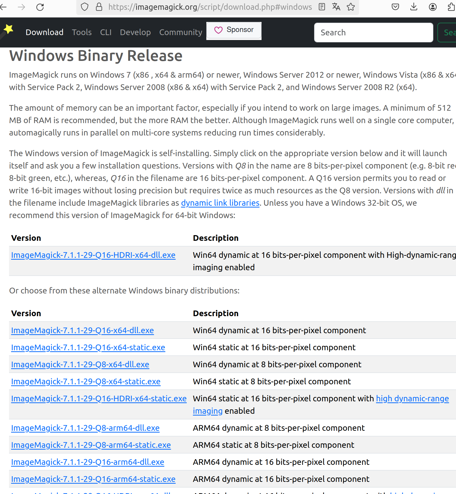
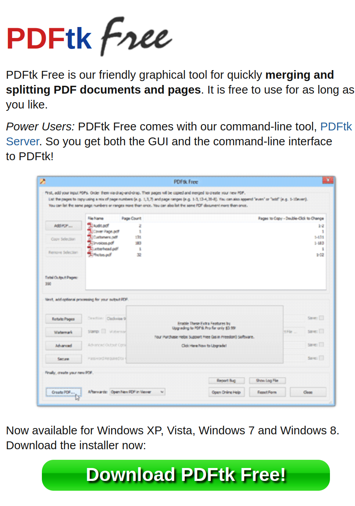

# Manipulation de fichier PDF

  Votre avocat vous demandera peut être de l'aider à lui fournir les pièces légales des requérants.
  En effet réaliser les documents au format PDF, surtout si vous avez beaucoup de personnes qui s'allient à votre action.
  L'idée est de le décharger pour qu'il puisse se concentrer sur sa plaidoirie.
  
## Document sources

 Vos requérents ou vous peuvent vous founir plusieurs fichiers pour le dossier et il faudra les consolider en une seul. 
 Les fichiers pouront être des photos au format jpeg, png ou autre ou encore des PDF.
 
 Les outils suivants vous aideront à les convertir en PDF et a combiner les PDF en un seul de plusieurs pages.
 Ces outils sont opensources (libre).
 

 
### ImageMagick

   ImageMagick est un utilitaire de manipulation et de creation d'image disponible sur [le site](https://imagemagick.org).
   
   Nous l'utiliserons pour convertir les images en fichier PDF.

  **Installation Windows :**
  
    
  
  **Installation Linux :**
  
    sudo apt-get install imagemagick
  
  
  **Utilisation Windows**
  
    magick convert recto.jpg verso.jpg  "cni.pdf"
  
  **Utilisation Linux**
  
    convert recto.jpg verso.jpg  "cni.pdf"
  
 
 
### PDFtk
 
  PDFtk est une suite d'outils disponible sous Windows et Linux
  Le site officiel est {PDF Labs](https://www.pdflabs.com/tools/pdftk-the-pdf-toolkit/).
  
  Nous l'utiliserons pour produite un fichier PDF avec tous les documents.
  
  
  **Installation Windows :**
  
    
  
  **Installation Linux :**
  
    sudo apt-get install pdftk
  
  
  **Utilisation**
  
    pdftk 'cni.pdf' 'bail.pdf' cat output "99-NOM Prenom.pdf"
  
 
   